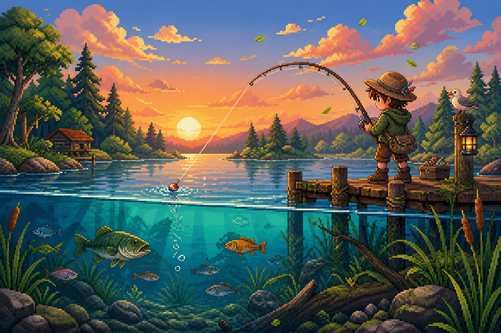

<div align="center">

# 🎣 Rise & Reel

### One key. No clock. Your tide, your pace.

A calm desktop fishing game about finding the rhythm, holding the line, and landing one more catch.

[简体中文](README.zh-CN.md)



</div>

## 🎬 Gameplay demo

https://github.com/user-attachments/assets/f779a675-283b-431c-a957-fca98b6c9b61

## 🌊 Settle in and keep the line moving

Rise & Reel turns fishing into a simple, satisfying rhythm:

- **Hold your chosen key** to lift the catch zone.
- **Release it** to let the zone fall.
- **Stay with the fish** long enough to reel it in.
- **Keep fishing without a timer**, then end the session whenever you are ready.

No frantic countdown. No account setup. Just you, the water, and the next catch.

## ✨ What is inside v0.1.0

- 🎮 A complete desktop Solo Fishing session.
- ⌨️ One configurable keyboard control.
- 🌍 English and Simplified Chinese interfaces.
- ⏸️ Pause, resume, restart confirmation, and a deliberate session ending.
- 📊 Session summaries with active time, score, catches, escapes, and best streak.
- 🏆 Personal bests, lifetime score, and the latest 100 sessions saved in your browser.
- 🧪 Automated coverage in Chromium, Firefox, and WebKit.

Version 0.1.0 is designed for desktop keyboard play. Multiplayer, 2D fishing, mobile touch controls, cloud sync, accounts, session recovery, and background music are outside this release.

## 🕹️ Controls

| Action | Control |
| --- | --- |
| Raise the catch zone | Hold your selected key |
| Lower the catch zone | Release the key |
| Pause or continue | Use the on-screen control |
| Finish a session | Choose **End session** and confirm |

## 🚀 Run it locally

Node.js 22 or newer is required.

```bash
npm install
npm run dev
```

Open `http://localhost:5173`, choose **Solo Fishing**, bind a key, and cast off.

## ✅ Verify the build

```bash
npm test
npm run test:e2e
npm run build
```

## 🧰 Built with

React 19 · TypeScript · Vite · Vitest · Playwright

## 📜 License

Rise & Reel is available under the [MIT License](LICENSE). Version 0.1.0 contains no background music or separately licensed audio assets.
