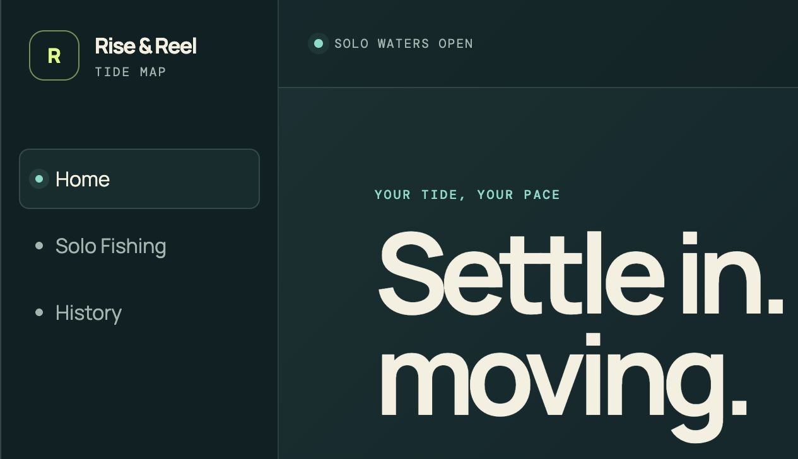

# Rise & Reel

[简体中文](README.zh-CN.md)

Rise & Reel is a browser-local desktop Solo Fishing game. Choose one keyboard key, wait through a short preparation countdown, then fish for as long as you like. Hold the key to lift the catch zone and release it to let the zone fall.



## Version 0.1.0 scope

- English and Simplified Chinese interface.
- One configurable keyboard control.
- Unlimited Solo sessions with pause, resume, restart confirmation, and confirmed ending.
- Session summaries with active time, score, catches, escapes, and best streak.
- Browser-local history for the latest 100 completed sessions.
- Personal-best and lifetime scores that remain correct when older history is pruned.

This release is desktop and keyboard only. It does not include multiplayer, 2D fishing, mobile touch controls, cloud sync, accounts, analytics, session recovery, or background music.

## Run locally

Node.js 22 or newer is required.

```bash
npm install
npm run dev
```

The development server normally opens at `http://localhost:5173`.

## Verify the candidate

```bash
npm run verify
```

This runs the unit tests, the Solo browser flow in Chromium, Firefox, and WebKit, the production build, and a Cloudflare deployment dry run.

## Browser-local data

Rise & Reel has no account, backend, or cloud synchronization. Preferences and completed Solo sessions stay in the current browser under versioned storage keys:

- `rise-and-reel.v1.preferences`
- `rise-and-reel.v1.solo-history`

On first load, the app removes only the known legacy keys `reel-rivals.preferences` and `reel-rivals.records`. It does not migrate their values or touch unrelated browser storage. See the [privacy note](PRIVACY.md) for details.

## Deployment candidate

The production build is a static single-page app configured for Cloudflare Workers Static Assets. The candidate declares:

- SPA fallback routing;
- the canonical URL `https://riseandreel.huggon1.com/`;
- Cloudflare preview URLs;
- the default `workers.dev` fallback.

The repository contains no Worker script, database, analytics binding, or secret. Building this candidate does not deploy it, switch the domain, create a tag, or publish a GitHub Release.

## License

Source code is available under the [MIT License](LICENSE). Version 0.1.0 contains no background music or separately licensed audio assets.
