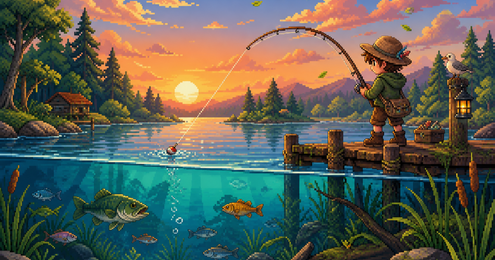

<div align="center">

# 🎣 Rise & Reel

### 一个按键，没有时限。跟着自己的潮汐慢慢钓。

一款轻松的桌面端钓鱼游戏：找到节奏，稳住钓线，再收获一条鱼。

[English](README.md) · [▶️ 查看游玩演示](docs/media/rise-and-reel-gameplay.mp4)

[](docs/media/rise-and-reel-gameplay.mp4)

**点击图片，观看 18 秒完整游玩演示。**

</div>

## 🌊 坐稳，抛线，跟上鱼的节奏

Rise & Reel 把钓鱼变成简单而有手感的节奏挑战：

- **按住你选择的按键**，捕获区向上移动。
- **松开按键**，捕获区自然下落。
- **持续跟住鱼的位置**，直到成功收线。
- **没有限时压力**，想钓多久就钓多久，准备好后再结束会话。

没有催促你的计时器，也不需要注册账号。这里只有你、水面和下一次捕获。

## ✨ v0.1.0 包含什么

- 🎮 完整的桌面端单人钓鱼会话。
- ⌨️ 一个可自由配置的键盘控制键。
- 🌍 英文与简体中文界面。
- ⏸️ 暂停、继续、重新开始确认和明确的结束流程。
- 📊 会话总结包含有效时长、分数、捕获数、逃脱数和最佳连击。
- 🏆 在当前浏览器保存个人最佳、累计得分和最近 100 次会话。
- 🧪 Chromium、Firefox 与 WebKit 自动化验证。

v0.1.0 专为桌面端键盘操作设计，不包含多人模式、2D 钓鱼、移动端触控、云同步、账号、会话恢复或背景音乐。

## 🕹️ 操作方式

| 动作 | 操作 |
| --- | --- |
| 抬升捕获区 | 按住已选择的按键 |
| 降低捕获区 | 松开按键 |
| 暂停或继续 | 使用画面中的按钮 |
| 结束会话 | 选择 **结束会话** 并确认 |

## 🚀 本地运行

需要 Node.js 22 或更高版本。

```bash
npm install
npm run dev
```

打开 `http://localhost:5173`，选择 **单人钓鱼**，绑定一个按键，然后开始抛线。

## ✅ 验证构建

```bash
npm test
npm run test:e2e
npm run build
```

## 🧰 技术栈

React 19 · TypeScript · Vite · Vitest · Playwright

## 📜 许可证

Rise & Reel 采用 [MIT License](LICENSE)。v0.1.0 不包含背景音乐或需要单独授权的音频资源。
