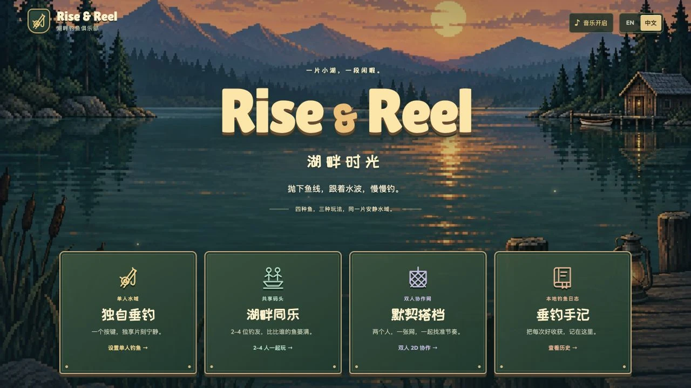
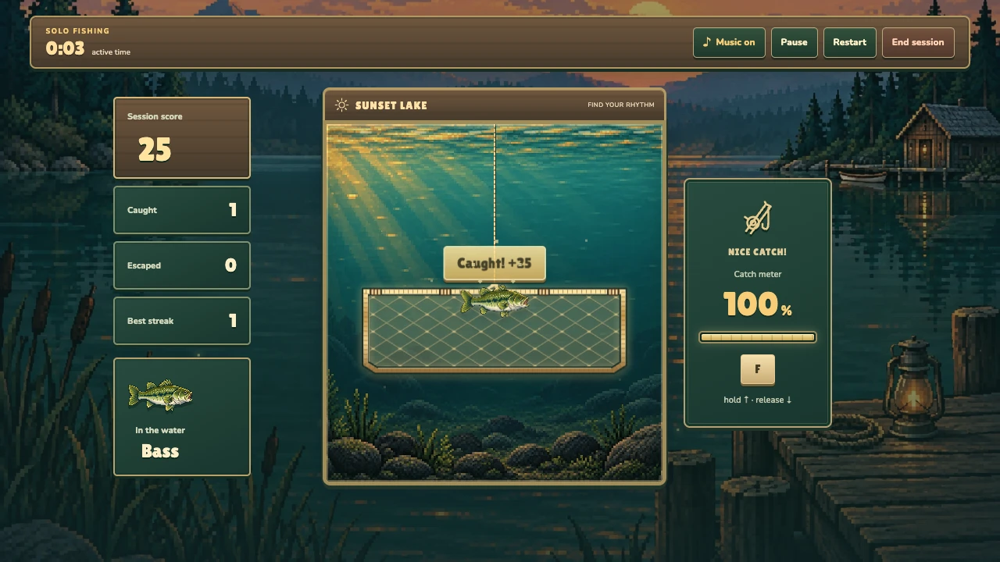
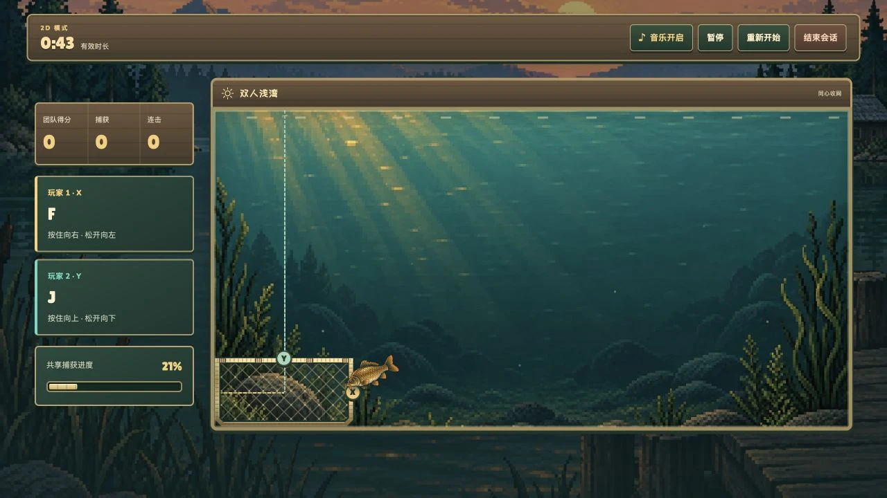
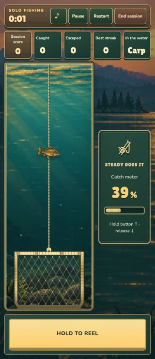
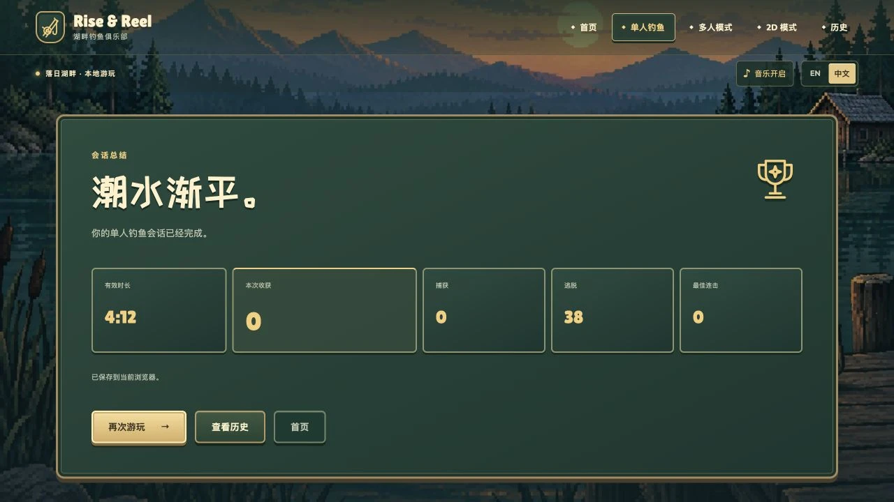

# Sunset Lake art review

Rise & Reel now opens into a continuous sunset lake scene. Menus, controls, scoreboards, and nets share warm rope/brass edges, timber, jade panels, and locally served game typography. The generated lake and underwater plates replace the previous environment assets. Fish species, physics, controls, scoring, and browser-local saves retain their existing behavior.

## Start locally

```sh
npm ci
npm run build
npm run preview -- --host 127.0.0.1
```

Open the URL printed by Vite. For development, use `npm run dev`.

## Review the experience

1. Start on the title screen and switch between English and Chinese. Check the large title, menu labels, and readable small text.
2. Choose Solo, assign a key, and start. Hold to lift the net; release to lower it. Look at the woven interior, rope lashings, water particles, and pressure feedback.
3. Keep a fish inside the net until it is caught. The reward plaque, fish motion, sparks, progress indicator, and score should agree. Pause/resume and confirm that playfield animations follow the session state.
4. Try four-player and 2D modes. Each player's line has a distinct color and label; the 2D net has matching X/Y handles. Decorative SVG resources are unique per net.
5. Finish a Solo session and inspect its summary and logbook. On touch screens, try portrait and landscape; the whole playfield and reel buttons stay on screen. Reduced-motion preferences disable decorative movement.

## Actual browser captures

These are screenshots of the implemented game, not image-generated UI concepts.

### Title screen, Chinese



### A catch through real keyboard input



[Watch the recorded keyboard-driven catch and pause/resume check](media/lakeside-review/solo-catch.webm).

### Cooperative play



### Mobile, 320 × 740



### Session summary



## Validation

- 40 engine, session, input, and storage unit tests.
- 42 browser tests across Chromium, Firefox, WebKit, and mobile Chromium, including real keyboard-driven capture, SVG resource isolation, reduced motion, language/music persistence, and complete touch layouts at 320 × 740, 320 × 568, and 740 × 320.
- Additional summary-layout checks keep the five results in one desktop row and the replay action within the viewport.
- Production build and local HTTP readiness verified.

Reproduce the capture evidence with:

```sh
npx playwright test --config playwright.review.config.ts
```

Recordings and screenshots appear in `test-results/art-review/`. The capture test steers through keyboard input while observing on-screen positions; it does not change the game state or inject scores. A fixed random source and a stepped browser frame clock make the control test repeatable without changing engine state.

See [runtime art notes](../src/assets/game/README.md) for the asset map, font choices, and exact image-generation prompts.
